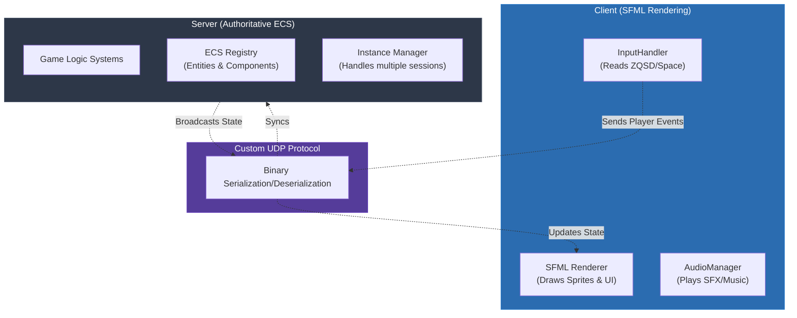

<div align="center">

# R-Type: Advanced Game Engine

**An Advanced Networked Multiplayer Game Engine in C++**

[](https://isocpp.org/)
[](https://cmake.org/)
[](https://www.sfml-dev.org/)
[](https://think-async.com/Asio/)

**[:fr: Version française disponible ici](README_FRENCH.md)**

*A modern reimagining of the classic horizontal shoot'em up (Shmup) genre built with a custom Entity-Component-System (ECS) and a robust UDP-based networking architecture.*

**How it works in a nutshell**: Instead of relying on a pre-built commercial engine, R-Type builds a custom multithreaded architecture from scratch. The server acts as the single authoritative source of truth, managing the game logic via an ECS pattern, while the client focuses purely on rendering using SFML and handling inputs. Communication flows through a bespoke binary UDP protocol designed for high-performance real-time synchronization.

</div>

<div align="center">


*R-Type running: intense multiplayer horizontal shoot'em up action with multiple players and enemies synchronized across the network.*

</div>

---

## Abstract

> **R-Type** is a C++ game development project that reimplements the classic horizontal shooter mechanics on top of a custom-built **Entity-Component-System (ECS)** and a **Multithreaded Server** architecture. Its defining technical choice is a strict separation between an authoritative server and dumb clients, communicating via a **custom UDP binary protocol**. The server manages all entities, collisions, and game logic, while the client simply sends input events and renders the resulting game state using **SFML**. This inversion of responsibility ensures a consistent multiplayer experience. The architecture heavily relies on C++20 features for safe, concurrent, and high-performance execution.

### Key Features

- **Authoritative Server** -- The server dictates all game logic, preventing client-side cheating and ensuring global state consistency.
- **Entity-Component-System (ECS)** -- A highly decoupled, modular architectural pattern where entities are just IDs, components contain raw data, and systems process logic.
- **Binary UDP Protocol** -- Fast, low-latency communication using a bespoke binary protocol designed for real-time multiplayer gaming.
- **Cross-Platform Compatibility** -- Fully supports both Linux and Windows environments out of the box.
- **Multi-threaded Architecture** -- The server effectively handles multiple game instances simultaneously utilizing modern C++ concurrency.
- **Dynamic Audio & Rendering** -- Rich graphics and sound management powered by SFML on the client side.
- **Accessibility Configurations** -- Built-in support for rebindable controls, visual filters (e.g., colorblind modes), and variable difficulty.

---

## Table of Contents

- [The Founding Principle: Authoritative ECS Engine](#the-founding-principle-authoritative-ecs-engine)
- [Network Synchronization](#network-synchronization)
- [Tech Stack](#tech-stack)
- [Project Structure](#project-structure)
- [Getting Started](#getting-started)
- [Commands](#commands)
- [Documentation & Resources](#documentation--resources)
- [Authors](#authors)

---

## The Founding Principle: Authoritative ECS Engine

At the core of the engine is the ECS (Entity-Component-System). Entities are lightweight IDs, Components are pure data structures (like `Position` or `Health`), and Systems contain all the logic that operates on those components.



**Direct consequences:**
- **The server is the *only* source of truth** for positions, health, collisions, and spawning.
- **Clients are merely visualizers**; they send intent (e.g., "move left") rather than facts (e.g., "I am at x=10").
- Adding a new feature (like a new enemy type) often just involves registering a new Component and adding a logic System on the Server, then assigning a sprite on the Client.

---

## Network Synchronization

To ensure smooth gameplay, the project implements a custom event-based UDP protocol:
- **Little-endian binary formatting** for minimal payload overhead.
- **Event-driven messaging**: Events like `MOVE`, `SHOOT`, and `JOIN` dictate actions.
- The server processes incoming events, ticks the ECS engine, and dispatches the new state.

---

## Tech Stack

- **C++20** - Core language, utilizing concepts, smart pointers, and multithreading.
- **CMake** - Cross-platform build system.
- **SFML (2.5.1+)** - Multimedia library used for 2D rendering, audio, and window management on the client.
- **Asio** - Cross-platform C++ library for network and low-level I/O programming.

---

## Project Structure

```
r-type/
├── src/
│   ├── client/        # SFML-based client application
│   │   ├── assets/    # Fonts, sounds, shaders, and sprites
│   │   └── src/       # Rendering and input systems
│   ├── server/        # Authoritative UDP server
│   │   ├── Engine/    # The core ECS (Registry, Components)
│   │   └── Game/      # Game-specific logic and instance management
│   └── common/        # Shared code (Networking Protocol, Utilities)
├── docs/              # Developer guides, RFC, Comparative Study
├── CMakeLists.txt     # Main build script
└── build.sh           # Build helper script
```

---

## Getting Started

### Prerequisites

- **CMake** 3.15 or higher
- A **C++20** compatible compiler (GCC, Clang, or MSVC)
- **SFML** 2.5.1+ development libraries

### Installation

1. **Clone the repository:**
   ```bash
   git clone git@github.com:EpitechPromo2027/B-CPP-500-MAR-5-2-rtype-theo.fabiano.git
   cd r-type
   ```

2. **Build the project:**
   ```bash
   ./build.sh
   ```
   *(On Windows, you can use CMake GUI or directly build using `cmake -B build` and `cmake --build build --config Release`)*

---

## Commands

### Running the Server

Start the authoritative server first (defaults to port 4242):
```bash
./r-type_server
```

### Running the Client

Start the client application to connect to the server (defaults to 127.0.0.1):
```bash
./r-type_client
```

**Controls:**
- **Movement:** Z/Q/S/D or Left Joystick
- **Shoot:** Space bar or 'A' button
- **Charge Shot:** Hold shoot button

---

## Documentation & Resources

- [Developer Guide](/docs/developer-guide.md) - Detailed ECS and component architecture
- [Network Protocol](/docs/network-protocol.txt) - In-depth UDP packet specifications
- [Technical Comparative Study](/docs/ComparativeStudy.md) - Analysis of engine choices

## Authors

- Theo FABIANO
- Theo MAESTRACCI
- Matthieu BOUSQUET
- Thomas VIDAL SAVELLI

## License

This project is licensed under the [MIT License](/docs/license.md).
