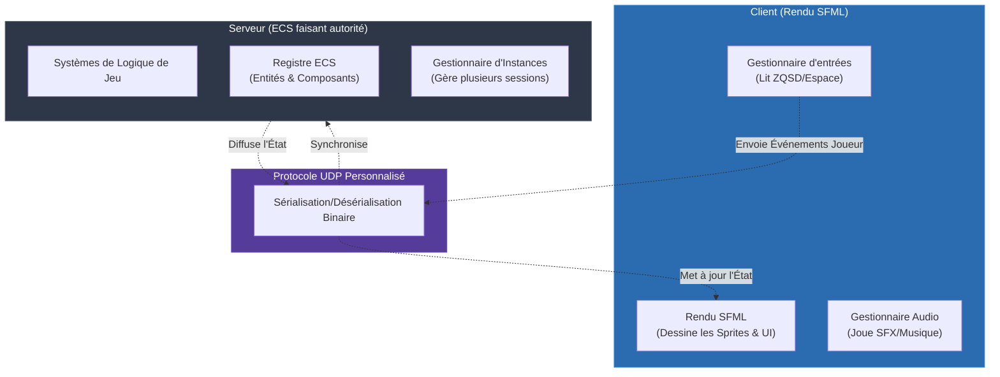

<div align="center">

# R-Type: Moteur de Jeu Avancé

**Un moteur de jeu multijoueur réseau avancé en C++**

[](https://isocpp.org/)
[](https://cmake.org/)
[](https://www.sfml-dev.org/)
[](https://think-async.com/Asio/)

**[:uk: English version available here](README.md)**

*Une réinvention moderne du genre classique shoot'em up (Shmup) horizontal, construit avec une architecture personnalisée Entité-Composant-Système (ECS) et un système réseau robuste basé sur UDP.*

**Comment ça marche en résumé** : Plutôt que de s'appuyer sur un moteur commercial existant, R-Type construit une architecture multithread personnalisée à partir de zéro. Le serveur agit comme la seule source de vérité (faisant autorité), gérant la logique du jeu via un modèle ECS, tandis que le client se concentre uniquement sur le rendu via SFML et la gestion des entrées. La communication s'effectue via un protocole UDP binaire sur mesure conçu pour une synchronisation en temps réel haute performance.

</div>

<div align="center">


*R-Type en action : de l'action multijoueur intense de shoot'em up horizontal avec plusieurs joueurs et ennemis synchronisés sur le réseau.*

</div>

---

## Résumé

> **R-Type** est un projet de développement de jeu en C++ qui réimplémente les mécaniques classiques de shooter horizontal sur un moteur personnalisé **Entité-Composant-Système (ECS)** et une architecture de **Serveur Multithread**. Son choix technique déterminant est une séparation stricte entre un serveur faisant autorité et des clients "stupides", communicant via un **protocole binaire UDP sur mesure**. Le serveur gère toutes les entités, les collisions et la logique du jeu, tandis que le client envoie simplement les événements d'entrée et fait le rendu de l'état du jeu via **SFML**. Cette inversion de responsabilité garantit une expérience multijoueur cohérente. L'architecture repose fortement sur les fonctionnalités de C++20 pour une exécution sûre, concurrente et performante.

### Fonctionnalités Clés

- **Serveur Faisant Autorité** -- Le serveur dicte toute la logique, empêchant la triche côté client et assurant la cohérence de l'état global.
- **Entité-Composant-Système (ECS)** -- Un modèle architectural hautement découplé et modulaire où les entités ne sont que des IDs, les composants contiennent des données brutes, et les systèmes traitent la logique.
- **Protocole UDP Binaire** -- Communication rapide et à faible latence utilisant un protocole binaire conçu pour le jeu multijoueur en temps réel.
- **Compatibilité Multiplateforme** -- Supporte pleinement les environnements Linux et Windows nativement.
- **Architecture Multithread** -- Le serveur gère efficacement plusieurs instances de jeu simultanément grâce à la concurrence C++ moderne.
- **Rendu et Audio Dynamiques** -- Gestion riche des graphismes et du son propulsée par SFML côté client.
- **Configurations d'Accessibilité** -- Prise en charge intégrée des contrôles redéfinissables, de filtres visuels (ex. modes daltoniens) et d'une difficulté variable.

---

## Table des Matières

- [Le Principe Fondateur : Moteur ECS Faisant Autorité](#le-principe-fondateur--moteur-ecs-faisant-autorité)
- [Synchronisation Réseau](#synchronisation-réseau)
- [Stack Technique](#stack-technique)
- [Structure du Projet](#structure-du-projet)
- [Pour Commencer](#pour-commencer)
- [Commandes](#commandes)
- [Documentation & Ressources](#documentation--ressources)
- [Auteurs](#auteurs)

---

## Le Principe Fondateur : Moteur ECS Faisant Autorité

Au cœur du moteur se trouve l'ECS (Entité-Composant-Système). Les Entités sont de simples identifiants légers, les Composants sont de pures structures de données (comme `Position` ou `Health`), et les Systèmes contiennent toute la logique qui opère sur ces composants.



**Conséquences directes :**
- **Le serveur est la *seule* source de vérité** pour les positions, la santé, les collisions et les apparitions.
- **Les clients ne sont que des visualiseurs** ; ils envoient des intentions (ex. "se déplacer à gauche") plutôt que des faits (ex. "je suis à x=10").
- Ajouter une nouvelle fonctionnalité (comme un nouveau type d'ennemi) implique souvent juste d'enregistrer un nouveau Composant et d'ajouter un Système logique sur le Serveur, puis d'assigner un sprite sur le Client.

---

## Synchronisation Réseau

Pour assurer un gameplay fluide, le projet implémente un protocole UDP basé sur les événements :
- **Formatage binaire little-endian** pour une surcharge minimale.
- **Messagerie orientée événements** : Les événements comme `MOVE`, `SHOOT` et `JOIN` dictent les actions.
- Le serveur traite les événements entrants, fait avancer le moteur ECS d'un tick, et distribue le nouvel état.

---

## Stack Technique

- **C++20** - Langage principal, utilisant les concepts, les smart pointers et le multithreading.
- **CMake** - Système de build multiplateforme.
- **SFML (2.5.1+)** - Bibliothèque multimédia utilisée pour le rendu 2D, l'audio et la gestion de fenêtre sur le client.
- **Asio** - Bibliothèque C++ pour la programmation réseau et les E/S bas niveau.

---

## Structure du Projet

```
r-type/
├── src/
│   ├── client/        # Application client SFML
│   │   ├── assets/    # Polices, sons, shaders, sprites
│   │   └── src/       # Systèmes de rendu et d'entrées
│   ├── server/        # Serveur UDP faisant autorité
│   │   ├── Engine/    # L'ECS central (Registry, Components)
│   │   └── Game/      # Logique de jeu et gestion des instances
│   └── common/        # Code partagé (Protocole réseau, Utilitaires)
├── docs/              # Guides, RFC, Étude Comparative
├── CMakeLists.txt     # Script principal CMake
└── build.sh           # Script de compilation
```

---

## Pour Commencer

### Prérequis

- **CMake** 3.15 ou supérieur
- Un compilateur compatible **C++20** (GCC, Clang ou MSVC)
- Bibliothèques de développement **SFML** 2.5.1+

### Installation

1. **Cloner le dépôt :**
   ```bash
   git clone git@github.com:EpitechPromo2027/B-CPP-500-MAR-5-2-rtype-theo.fabiano.git
   cd r-type
   ```

2. **Compiler le projet :**
   ```bash
   ./build.sh
   ```
   *(Sur Windows, vous pouvez utiliser CMake GUI ou compiler directement avec `cmake -B build` et `cmake --build build --config Release`)*

---

## Commandes

### Lancer le Serveur

Démarrez d'abord le serveur faisant autorité (port par défaut 4242) :
```bash
./r-type_server
```

### Lancer le Client

Démarrez l'application client pour vous connecter au serveur (défaut : 127.0.0.1) :
```bash
./r-type_client
```

**Contrôles :**
- **Mouvement :** Z/Q/S/D ou Joystick Gauche
- **Tirer :** Barre Espace ou bouton 'A'
- **Tir Chargé :** Maintenir le bouton de tir

---

## Documentation & Ressources

- [Guide Développeur](/docs/developer-guide.md) - Architecture ECS détaillée
- [Protocole Réseau](/docs/network-protocol.txt) - Spécifications UDP
- [Étude Comparative](/docs/ComparativeStudy.md) - Analyse des choix moteurs

## Auteurs

- Theo FABIANO
- Theo MAESTRACCI
- Matthieu BOUSQUET
- Thomas VIDAL SAVELLI

## Licence

Ce projet est sous licence [MIT](/docs/license.md).
